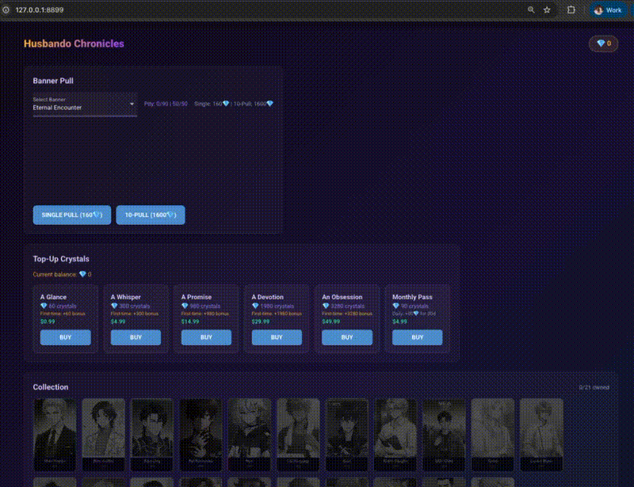
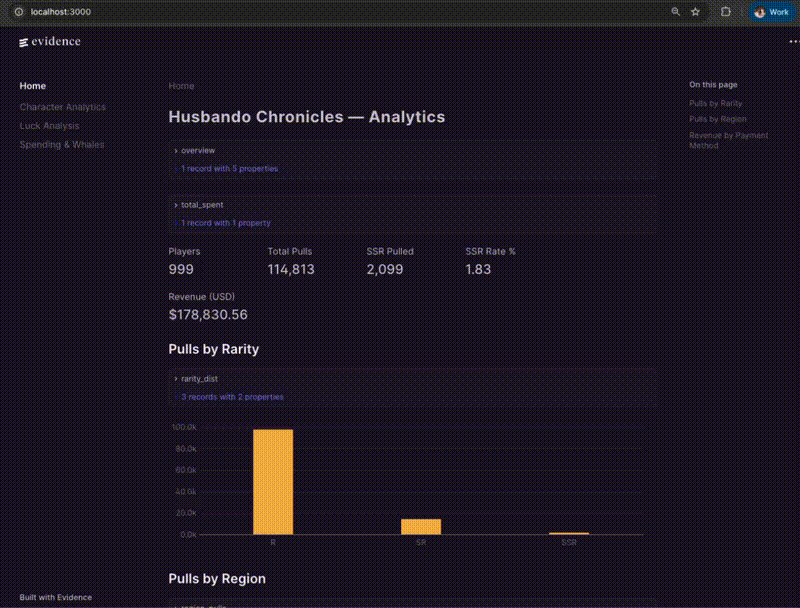
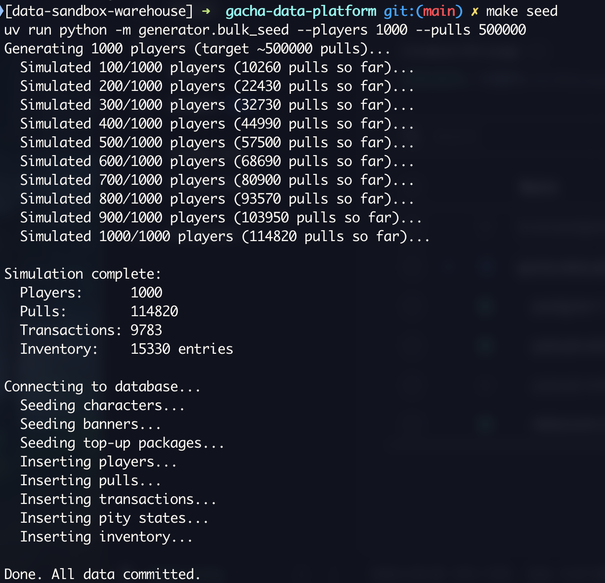
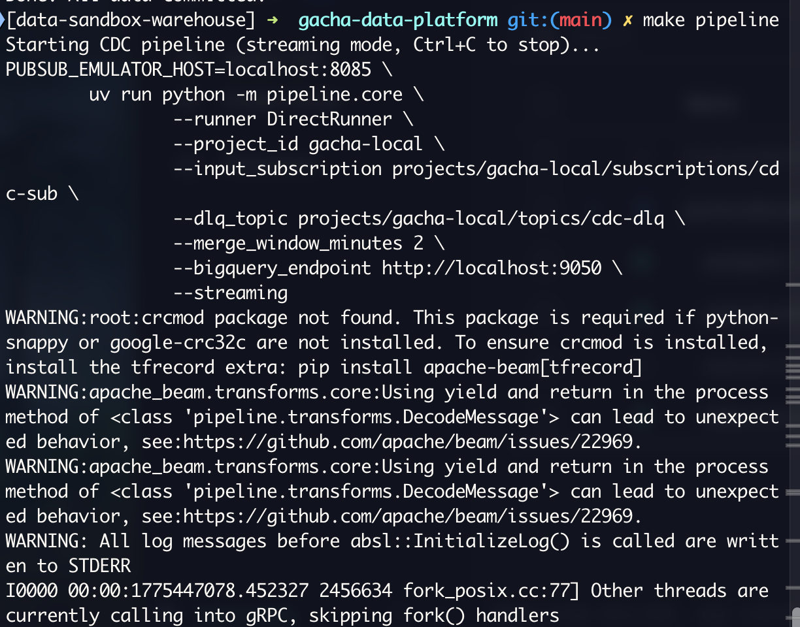
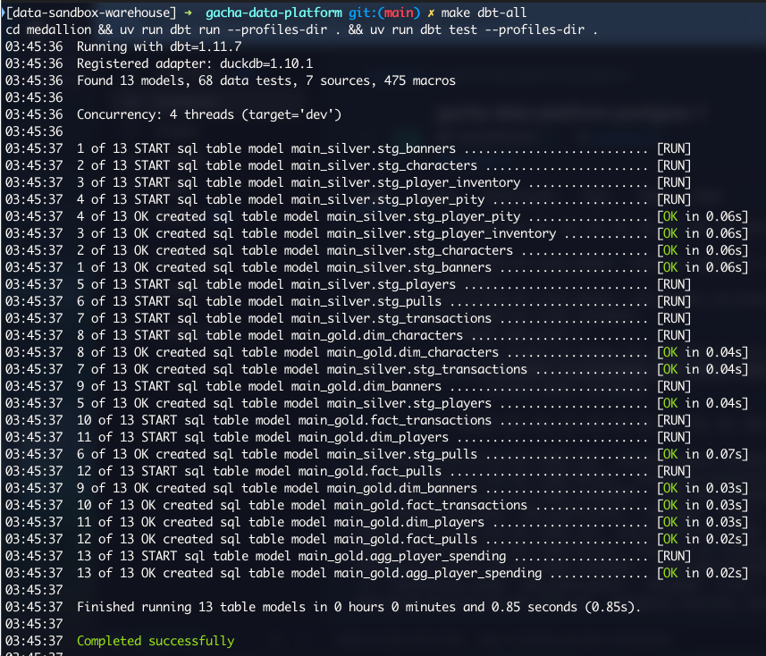
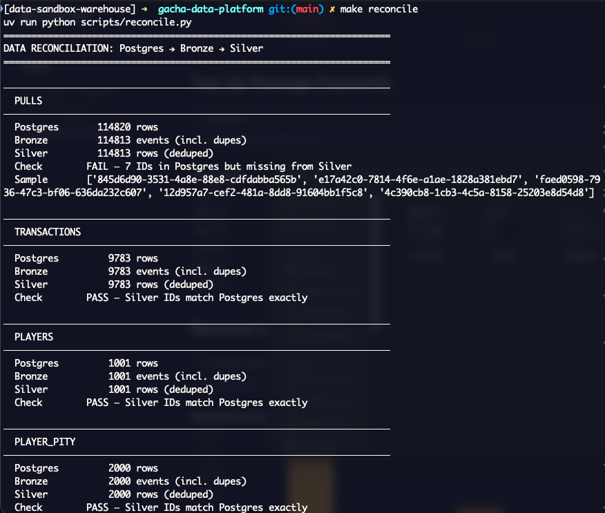
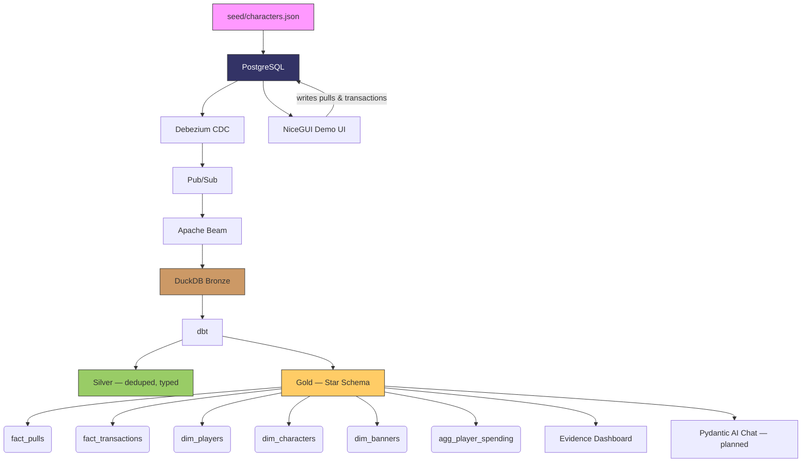

# Gacha Data Platform

A production-grade data platform built around a husbando gacha game — CDC streaming, Medallion architecture, star schema, and an LLM query layer. All running on generated data.

Not a game. It's the **data infrastructure behind one.**

---

## What This Showcases

- **CDC Streaming:** PostgreSQL → Debezium → Pub/Sub → Apache Beam → DuckDB/BigQuery
- **Medallion Architecture:** Bronze (raw CDC) → Silver (deduped, typed) → Gold (star schema)
- **Kimball Star Schema:** Facts + dimensions modeled in dbt with 58 tests
- **Local-first:** Full stack runs on Docker Compose — no cloud account needed
- **Dual warehouse:** DuckDB for local dev, BigQuery for GCP (same dbt models, different profiles)
- **Demo UI:** NiceGUI game interface — pull for husbandos, top up crystals, view collection. Every click writes to Postgres for live CDC demo.
- **Analytics Dashboard:** Evidence.dev — luck analysis, whale leaderboard, character stats, banner performance
- **LLM Query Layer:** Natural language queries over gacha analytics (planned — Pydantic AI + Logfire)

---

## Demo

### Game UI — Pull, Top Up, Collect


### Analytics Dashboard (Evidence.dev)


### Pipeline in Action

| Seed | CDC Pipeline |
|------|-------------|
|  |  |

| dbt Transform | Data Reconciliation |
|--------------|-------------------|
|  |  |

---

## The Game: Husbando Chronicles

A simplified gacha system. You pull for husbandos. That's it.

| Rarity | Rate | Pity |
|--------|------|------|
| **SSR** ★★★★★ | 1.5% (6% soft pity at 74+) | Guaranteed at 90 |
| **SR** ★★★★ | 10% | Guaranteed every 10 |
| **R** ★★★ | 88.5% | — |

21 characters across archetypes — Cold CEO, Gentle Doctor, Chaotic Gamer Boy, Playful Fox Spirit, and more. See [`seed/characters.json`](./seed/characters.json).

Two data streams:
- **Gacha pulls** — banner selection, pity tracking, 50/50 mechanic
- **Top-up transactions** — crystal purchases, monthly pass, refunds, failed payments

---

## Quick Start

```bash
# Prerequisites: Docker, uv (Python package manager)

# 1. Start infrastructure (Postgres, Pub/Sub emulator, Debezium CDC)
make up

# 2. Seed source data (50 players, ~10k pulls + transactions)
make seed-small          # or: make seed (1000 players, 500k pulls)

# 3. Start CDC pipeline (separate terminal — long-running)
make pipeline            # Ctrl+C to stop

# 4. Stop pipeline, then validate Bronze landed correctly
make reconcile           # Postgres vs DuckDB row/ID reconciliation

# 5. Transform Bronze → Silver → Gold
make dbt-all             # run + test

# 6. Launch demo UI (pull husbandos, top up crystals)
make ui                  # http://localhost:8899

# 7. Launch analytics dashboard
make dashboard           # http://localhost:3000
```

No GCP account needed. Everything runs locally via Docker + DuckDB.

> **Note:** DuckDB is single-writer — stop the pipeline (`Ctrl+C`) before running dbt, reconcile, or dashboard.

---

## Architecture



---

## Project Structure

```
gacha-data-platform/
├── seed/                    ← Character data, schema, portraits
│   ├── characters.json      ← 21 husbandos with visual prompts
│   ├── schema.sql           ← PostgreSQL source schema
│   └── portraits/           ← AI-generated character art (WebP, 3:4)
├── generator/               ← Data generator (Faker + gacha logic)
├── pipeline/                ← Apache Beam CDC pipeline (Bronze writes)
│   ├── warehouse.py         ← DuckDB (local) / BigQuery (GCP) abstraction
│   └── debezium/            ← Debezium Server config
├── medallion/               ← dbt project (Bronze → Silver → Gold)
│   ├── models/staging/      ← 7 staging models (dedup + type-cast)
│   └── models/marts/        ← 6 mart models (Kimball star schema)
├── scripts/                 ← Init scripts + data reconciliation
├── tests/                   ← 34 tests (gacha math + pipeline transforms)
├── dashboard/               ← Evidence.dev analytics (SQL + markdown)
├── chat/                    ← Pydantic AI agent + Logfire (planned)
├── ui/                      ← NiceGUI demo interface (writes to Postgres)
├── infra/                   ← Pulumi GCP deployment (planned)
├── docker-compose.yml       ← Postgres, Pub/Sub emulator, Debezium
├── Makefile                 ← make up / seed / pipeline / dbt-all / ui / dashboard
└── pyproject.toml           ← uv managed dependencies
```

---

## Local vs GCP

| Component | Local (Docker Compose) | GCP (Pulumi) |
|-----------|----------------------|--------------|
| Source DB | Postgres container | Cloud SQL |
| CDC | Logical replication → local | Postgres → Pub/Sub |
| Pipeline | Beam DirectRunner | Dataflow |
| Warehouse | DuckDB | BigQuery |
| UI + Chat | NiceGUI (localhost) | Cloud Run |
| Tracing | Logfire | Logfire Cloud |

---

`Python` · `Apache Beam` · `Debezium` · `PostgreSQL` · `DuckDB` · `BigQuery` · `Pub/Sub` · `dbt` · `NiceGUI` · `Evidence.dev` · `Docker` · `uv`
